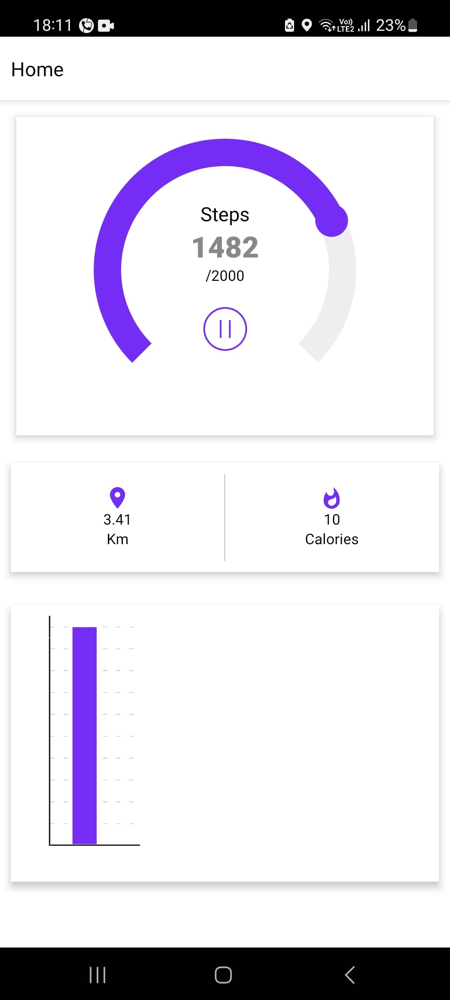

# Heald Senior React Native developer Demo App

## Introducation

I'm Lalit kumar. In this repo i'm repseting the demo application 
develop for Heald App. This application use t0 track user physical activity. Like:  steps count, distance travel and calories burn.

Here i'm adding image for video for more refernce 

# Image

## Heald Demo App

In this application i implement all features and functionality as the the requirement doc. like get the steps count from the accelometer, track the location from GPS and other. 
In use few help libraries to achived this all features like 
 1. react-native-community/geolocation (to get the GPS data).
 2. @dongminyu/react-native-step-counter (to calculate the stesp count in application).
 3. react-native-background-actions, The main requirement to run application in background as well so i use  library it's run different service in app. Performce the background task.

I also the graph library to implemnt the graph functionlaity. 

### These things which specially 

 1. Use MvvM coding architecture.
 2. Implement all main feature and bonus feature like background taks, best coding pratices
 3. Use custom hooks and memorization as per requirement to improve the application overall performance 
  

## Open issue

Note: There is few open issue in the application 
1. Distance update randomly. It's  relate to the previoius distance + new distance calcualtation 
2. Calories, Not get update. I found it in object still few calculation is missing in this part.   
